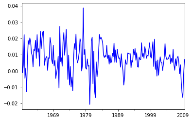
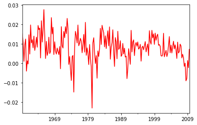
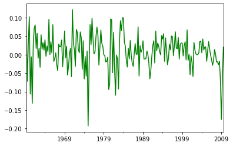
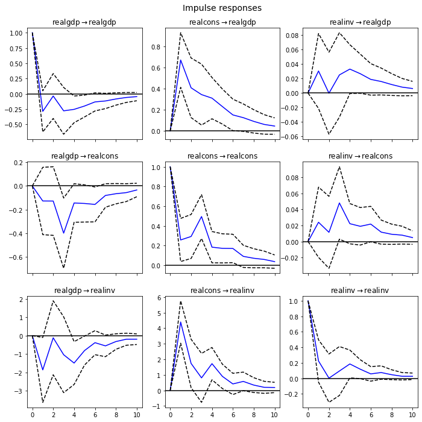
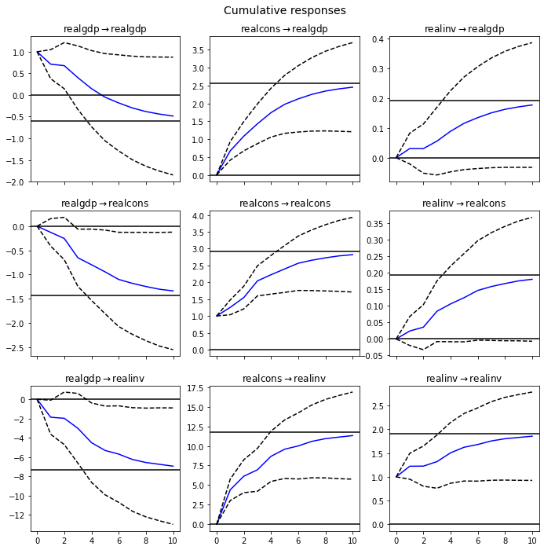

```python
import pandas as pd
import numpy as np
import matplotlib.pyplot as plt
%matplotlib inline

# Import Statsmodels
import statsmodels.api as sm
from statsmodels.tsa.api import VAR
from statsmodels.tsa.stattools import adfuller
from statsmodels.tools.eval_measures import rmse, aic

from statsmodels.tsa.vector_ar.var_model import VARResults, VARProcess

```

# Ejemplo obtenido de Lutkepohl

## Importar los datos

```python
mdata = sm.datasets.macrodata.load_pandas().data

mdata.index = pd.period_range('1959-03-31', '2009-09-30', freq='Q')

mdata = mdata[['realgdp','realcons','realinv']]

data = np.log(mdata).diff().dropna()


```

```python
data.head()
```

<div>
<style scoped>
    .dataframe tbody tr th:only-of-type {
        vertical-align: middle;
    }

    .dataframe tbody tr th {
        vertical-align: top;
    }

    .dataframe thead th {
        text-align: right;
    }

</style>
<table border="1" class="dataframe">
  <thead>
    <tr style="text-align: right;">
      <th></th>
      <th>realgdp</th>
      <th>realcons</th>
      <th>realinv</th>
    </tr>
  </thead>
  <tbody>
    <tr>
      <th>1959Q2</th>
      <td>0.024942</td>
      <td>0.015286</td>
      <td>0.080213</td>
    </tr>
    <tr>
      <th>1959Q3</th>
      <td>-0.001193</td>
      <td>0.010386</td>
      <td>-0.072131</td>
    </tr>
    <tr>
      <th>1959Q4</th>
      <td>0.003495</td>
      <td>0.001084</td>
      <td>0.034425</td>
    </tr>
    <tr>
      <th>1960Q1</th>
      <td>0.022190</td>
      <td>0.009534</td>
      <td>0.102664</td>
    </tr>
    <tr>
      <th>1960Q2</th>
      <td>-0.004685</td>
      <td>0.012572</td>
      <td>-0.106694</td>
    </tr>
  </tbody>
</table>
</div>

## Gráficar las series

```python
data['realgdp'].plot(color = 'b')
plt.show()
```



```python
data['realcons'].plot(color = 'r')
plt.show()
```



```python
data['realinv'].plot(color = 'g')
plt.show()
```



```python
def adfuller_test(series, signif=0.05, name='', verbose=False):
    """Perform ADFuller to test for Stationarity of given series and print report"""
    r = adfuller(series, autolag='AIC')
    output = {'test_statistic':round(r[0], 4), 'pvalue':round(r[1], 4), 'n_lags':round(r[2], 4), 'n_obs':r[3]}
    p_value = output['pvalue']
    def adjust(val, length= 6): return str(val).ljust(length)

    # Print Summary
    print(f'    Augmented Dickey-Fuller Test on "{name}"', "\n   ", '-'*47)
    print(f' Null Hypothesis: Data has unit root. Non-Stationary.')
    print(f' Significance Level    = {signif}')
    print(f' Test Statistic        = {output["test_statistic"]}')
    print(f' No. Lags Chosen       = {output["n_lags"]}')

    for key,val in r[4].items():
        print(f' Critical value {adjust(key)} = {round(val, 3)}')

    if p_value <= signif:
        print(f" => P-Value = {p_value}. Rejecting Null Hypothesis.")
        print(f" => Series is Stationary.")
    else:
        print(f" => P-Value = {p_value}. Weak evidence to reject the Null Hypothesis.")
        print(f" => Series is Non-Stationary.")
```

```python
for name, column in data.iteritems():
    adfuller_test(column, name=column.name)
    print('\n')
```

        Augmented Dickey-Fuller Test on "realgdp"
        -----------------------------------------------
     Null Hypothesis: Data has unit root. Non-Stationary.
     Significance Level    = 0.05
     Test Statistic        = -6.9729
     No. Lags Chosen       = 1
     Critical value 1%     = -3.463
     Critical value 5%     = -2.876
     Critical value 10%    = -2.575
     => P-Value = 0.0. Rejecting Null Hypothesis.
     => Series is Stationary.


        Augmented Dickey-Fuller Test on "realcons"
        -----------------------------------------------
     Null Hypothesis: Data has unit root. Non-Stationary.
     Significance Level    = 0.05
     Test Statistic        = -4.992
     No. Lags Chosen       = 2
     Critical value 1%     = -3.464
     Critical value 5%     = -2.876
     Critical value 10%    = -2.575
     => P-Value = 0.0. Rejecting Null Hypothesis.
     => Series is Stationary.


        Augmented Dickey-Fuller Test on "realinv"
        -----------------------------------------------
     Null Hypothesis: Data has unit root. Non-Stationary.
     Significance Level    = 0.05
     Test Statistic        = -12.219
     No. Lags Chosen       = 0
     Critical value 1%     = -3.463
     Critical value 5%     = -2.876
     Critical value 10%    = -2.574
     => P-Value = 0.0. Rejecting Null Hypothesis.
     => Series is Stationary.

## Definir y estimar el VAR model

```python
# make a VAR model
model = VAR(data)
```

## Seleccion de rezagos

```python
model.select_order(maxlags=12).summary()
```

<table class="simpletable">
<caption>VAR Order Selection (* highlights the minimums)</caption>
<tr>
   <td></td>      <th>AIC</th>         <th>BIC</th>         <th>FPE</th>        <th>HQIC</th>    
</tr>
<tr>
  <th>0</th>  <td>    -27.72</td>  <td>    -27.67</td>  <td> 9.157e-13</td>  <td>    -27.70</td> 
</tr>
<tr>
  <th>1</th>  <td>    -28.05</td>  <td>    -27.84*</td> <td> 6.596e-13</td>  <td>    -27.96*</td>
</tr>
<tr>
  <th>2</th>  <td>    -28.05</td>  <td>    -27.69</td>  <td> 6.594e-13</td>  <td>    -27.90</td> 
</tr>
<tr>
  <th>3</th>  <td>    -28.06*</td> <td>    -27.54</td>  <td> 6.542e-13*</td> <td>    -27.85</td> 
</tr>
<tr>
  <th>4</th>  <td>    -28.04</td>  <td>    -27.37</td>  <td> 6.640e-13</td>  <td>    -27.77</td> 
</tr>
<tr>
  <th>5</th>  <td>    -28.03</td>  <td>    -27.21</td>  <td> 6.741e-13</td>  <td>    -27.69</td> 
</tr>
<tr>
  <th>6</th>  <td>    -27.98</td>  <td>    -27.00</td>  <td> 7.101e-13</td>  <td>    -27.58</td> 
</tr>
<tr>
  <th>7</th>  <td>    -27.94</td>  <td>    -26.81</td>  <td> 7.365e-13</td>  <td>    -27.48</td> 
</tr>
<tr>
  <th>8</th>  <td>    -27.94</td>  <td>    -26.66</td>  <td> 7.376e-13</td>  <td>    -27.42</td> 
</tr>
<tr>
  <th>9</th>  <td>    -27.97</td>  <td>    -26.53</td>  <td> 7.191e-13</td>  <td>    -27.39</td> 
</tr>
<tr>
  <th>10</th> <td>    -27.93</td>  <td>    -26.34</td>  <td> 7.498e-13</td>  <td>    -27.28</td> 
</tr>
<tr>
  <th>11</th> <td>    -27.87</td>  <td>    -26.12</td>  <td> 7.988e-13</td>  <td>    -27.16</td> 
</tr>
<tr>
  <th>12</th> <td>    -27.84</td>  <td>    -25.94</td>  <td> 8.271e-13</td>  <td>    -27.07</td> 
</tr>
</table>

## Estimar el VAR

```python
results = model.fit(3)
results.summary()
```

      Summary of Regression Results
    ==================================
    Model:                         VAR
    Method:                        OLS
    Date:           Tue, 11, Aug, 2020
    Time:                     17:15:02
    --------------------------------------------------------------------
    No. of Equations:         3.00000    BIC:                   -27.4257
    Nobs:                     199.000    HQIC:                  -27.7212
    Log likelihood:           1961.15    FPE:                7.47593e-13
    AIC:                     -27.9222    Det(Omega_mle):     6.45336e-13
    --------------------------------------------------------------------
    Results for equation realgdp
    ==============================================================================
                     coefficient       std. error           t-stat            prob
    ------------------------------------------------------------------------------
    const               0.001281         0.001295            0.989           0.322
    L1.realgdp         -0.286148         0.171582           -1.668           0.095
    L1.realcons         0.673869         0.132245            5.096           0.000
    L1.realinv          0.030578         0.026428            1.157           0.247
    L2.realgdp          0.025691         0.174478            0.147           0.883
    L2.realcons         0.295441         0.147990            1.996           0.046
    L2.realinv         -0.014443         0.026963           -0.536           0.592
    L3.realgdp         -0.180031         0.174857           -1.030           0.303
    L3.realcons         0.183702         0.148048            1.241           0.215
    L3.realinv          0.012632         0.026449            0.478           0.633
    ==============================================================================

    Results for equation realcons
    ==============================================================================
                     coefficient       std. error           t-stat            prob
    ------------------------------------------------------------------------------
    const               0.004837         0.001094            4.420           0.000
    L1.realgdp         -0.127156         0.144955           -0.877           0.380
    L1.realcons         0.256394         0.111722            2.295           0.022
    L1.realinv          0.024043         0.022326            1.077           0.282
    L2.realgdp         -0.086634         0.147402           -0.588           0.557
    L2.realcons         0.205707         0.125024            1.645           0.100
    L2.realinv          0.003846         0.022779            0.169           0.866
    L3.realgdp         -0.359067         0.147722           -2.431           0.015
    L3.realcons         0.418452         0.125073            3.346           0.001
    L3.realinv          0.041906         0.022345            1.875           0.061
    ==============================================================================

    Results for equation realinv
    ==============================================================================
                     coefficient       std. error           t-stat            prob
    ------------------------------------------------------------------------------
    const              -0.020597         0.006812           -3.024           0.002
    L1.realgdp         -1.862537         0.902338           -2.064           0.039
    L1.realcons         4.403374         0.695465            6.332           0.000
    L1.realinv          0.223717         0.138981            1.610           0.107
    L2.realgdp          0.331425         0.917568            0.361           0.718
    L2.realcons         0.878198         0.778270            1.128           0.259
    L2.realinv         -0.096555         0.141797           -0.681           0.496
    L3.realgdp         -0.488310         0.919562           -0.531           0.595
    L3.realcons        -0.123787         0.778572           -0.159           0.874
    L3.realinv          0.033453         0.139095            0.241           0.810
    ==============================================================================

    Correlation matrix of residuals
                 realgdp  realcons   realinv
    realgdp     1.000000  0.599898  0.759619
    realcons    0.599898  1.000000  0.142964
    realinv     0.759619  0.142964  1.000000

```python
results1 = model.fit(maxlags=12, ic='aic')
results1.summary()
```

      Summary of Regression Results
    ==================================
    Model:                         VAR
    Method:                        OLS
    Date:           Tue, 11, Aug, 2020
    Time:                     17:15:02
    --------------------------------------------------------------------
    No. of Equations:         3.00000    BIC:                   -27.4257
    Nobs:                     199.000    HQIC:                  -27.7212
    Log likelihood:           1961.15    FPE:                7.47593e-13
    AIC:                     -27.9222    Det(Omega_mle):     6.45336e-13
    --------------------------------------------------------------------
    Results for equation realgdp
    ==============================================================================
                     coefficient       std. error           t-stat            prob
    ------------------------------------------------------------------------------
    const               0.001281         0.001295            0.989           0.322
    L1.realgdp         -0.286148         0.171582           -1.668           0.095
    L1.realcons         0.673869         0.132245            5.096           0.000
    L1.realinv          0.030578         0.026428            1.157           0.247
    L2.realgdp          0.025691         0.174478            0.147           0.883
    L2.realcons         0.295441         0.147990            1.996           0.046
    L2.realinv         -0.014443         0.026963           -0.536           0.592
    L3.realgdp         -0.180031         0.174857           -1.030           0.303
    L3.realcons         0.183702         0.148048            1.241           0.215
    L3.realinv          0.012632         0.026449            0.478           0.633
    ==============================================================================

    Results for equation realcons
    ==============================================================================
                     coefficient       std. error           t-stat            prob
    ------------------------------------------------------------------------------
    const               0.004837         0.001094            4.420           0.000
    L1.realgdp         -0.127156         0.144955           -0.877           0.380
    L1.realcons         0.256394         0.111722            2.295           0.022
    L1.realinv          0.024043         0.022326            1.077           0.282
    L2.realgdp         -0.086634         0.147402           -0.588           0.557
    L2.realcons         0.205707         0.125024            1.645           0.100
    L2.realinv          0.003846         0.022779            0.169           0.866
    L3.realgdp         -0.359067         0.147722           -2.431           0.015
    L3.realcons         0.418452         0.125073            3.346           0.001
    L3.realinv          0.041906         0.022345            1.875           0.061
    ==============================================================================

    Results for equation realinv
    ==============================================================================
                     coefficient       std. error           t-stat            prob
    ------------------------------------------------------------------------------
    const              -0.020597         0.006812           -3.024           0.002
    L1.realgdp         -1.862537         0.902338           -2.064           0.039
    L1.realcons         4.403374         0.695465            6.332           0.000
    L1.realinv          0.223717         0.138981            1.610           0.107
    L2.realgdp          0.331425         0.917568            0.361           0.718
    L2.realcons         0.878198         0.778270            1.128           0.259
    L2.realinv         -0.096555         0.141797           -0.681           0.496
    L3.realgdp         -0.488310         0.919562           -0.531           0.595
    L3.realcons        -0.123787         0.778572           -0.159           0.874
    L3.realinv          0.033453         0.139095            0.241           0.810
    ==============================================================================

    Correlation matrix of residuals
                 realgdp  realcons   realinv
    realgdp     1.000000  0.599898  0.759619
    realcons    0.599898  1.000000  0.142964
    realinv     0.759619  0.142964  1.000000

```python

```

## Analsis de residuos

En las secciones anteriores, hemos considerado procedimientos para elegir el orden de un modelo VAR para el proceso de generación de una serie de tiempo múltiple dada. Los criterios para la elección del modelo pueden considerarse criterios para decidir si los residuos están lo suficientemente cerca del ruido blanco. Por supuesto, si, por ejemplo, el pronóstico es el objetivo, puede no ser de suma importancia si los residuos son realmente ruido blanco siempre que el modelo pronostique bien.

Sin embargo, hay situaciones en las que resulta interesante comprobar el supuesto de ruido blanco para los residuos de un modelo en particular. Por ejemplo, si el orden del modelo se elige por métodos no estadísticos (por ejemplo, sobre la base de alguna teoría económica), puede ser útil tener herramientas estadísticas disponibles para investigar las propiedades de los residuos.

```python


# Ho: Residuals are white noise

results.test_whiteness(nlags=12).summary()
```

<table class="simpletable">
<caption>Portmanteau-test for residual autocorrelation. H_0: residual autocorrelation up to lag 12 is zero. Conclusion: fail to reject H_0 at 5% significance level.</caption>
<tr>
  <th>Test statistic</th> <th>Critical value</th> <th>p-value</th> <th>df</th>
</tr>
<tr>
       <td>89.52</td>          <td>103.0</td>      <td>0.242</td>  <td>81</td>
</tr>
</table>

## Normalidad de residuos

Se necesita la normalidad del proceso de generación de datos, por ejemplo, en la configuración de intervalos de pronóstico. Los residuos no normales también pueden indicar de manera más general que el modelo no es una buena representación del proceso de generación de datos. Por lo tanto, probar este supuesto de distribución es deseable.

```python
results.test_normality().summary()
```

<table class="simpletable">
<caption>normality (skew and kurtosis) test. H_0: data generated by normally-distributed process. Conclusion: reject H_0 at 5% significance level.</caption>
<tr>
  <th>Test statistic</th> <th>Critical value</th> <th>p-value</th> <th>df</th>
</tr>
<tr>
       <td>31.92</td>          <td>12.59</td>      <td>0.000</td>   <td>6</td>
</tr>
</table>

## Impulso Respuesta

```python
irf = results.irf(10)
irf.plot(orth=False)
plt.show()
```



```python
irf.plot_cum_effects(orth=False)
plt.show()
```



## Descomposicion de la varianza

```python
fevd = results.fevd(5)

fevd.summary()
```

    FEVD for realgdp
          realgdp  realcons   realinv
    0    1.000000  0.000000  0.000000
    1    0.864889  0.129253  0.005858
    2    0.816725  0.177898  0.005378
    3    0.793647  0.197590  0.008763
    4    0.777279  0.208127  0.014594

    FEVD for realcons
          realgdp  realcons   realinv
    0    0.359877  0.640123  0.000000
    1    0.358767  0.635420  0.005813
    2    0.348044  0.645138  0.006817
    3    0.319913  0.653609  0.026478
    4    0.317407  0.652180  0.030414

    FEVD for realinv
          realgdp  realcons   realinv
    0    0.577021  0.152783  0.270196
    1    0.488158  0.293622  0.218220
    2    0.478727  0.314398  0.206874
    3    0.477182  0.315564  0.207254
    4    0.466741  0.324135  0.209124

```python
results.test_causality('realgdp', 'realinv', kind='f').summary()
```

<table class="simpletable">
<caption>Granger causality F-test. H_0: realinv does not Granger-cause realgdp. Conclusion: fail to reject H_0 at 5% significance level.</caption>
<tr>
  <th>Test statistic</th> <th>Critical value</th> <th>p-value</th>    <th>df</th>   
</tr>
<tr>
      <td>0.5631</td>          <td>2.621</td>      <td>0.640</td>  <td>(3, 567)</td>
</tr>
</table>

```python

```

```python
# params = results.params
# endog_lagged = results.endog_lagged
# endog = results.endog
# sigma_u = results.sigma_u
# lag_order = results.k_ar
# exog = results.intercept
```

```python
# n =120

# y = np.zeros(n)

# z = np.zeros(n)


# for i in range(0,n):

#     εy = np.random.normal(0, 1, 1)
#     εz = np.random.normal(0, 1, 1)

#     e2 = εz
#     e1 = εy + 0.8*εz


#     y[i] = 0.7*y[i - 1] + 0.2*z[i-1]+ e1

#     z[i] = 0.2*y[i - 1] + 0.7*z[i-1]+ e2


# y = pd.Series(y)

# z = pd.Series(z)

# frame = {'y':y,'z':z}
```

```python
# A1 = np.array([[0.7, 0.2],[0.2, 0.7]])
# B = np.array([[1, 0.8],[0, 1]])
# Binv = np.linalg.inv(B)
# B*A1
```

```python
# df = pd.DataFrame(frame)
# df.index = pd.period_range('2001-01-01', '2010-12-01', freq='M')
```

```python

```
